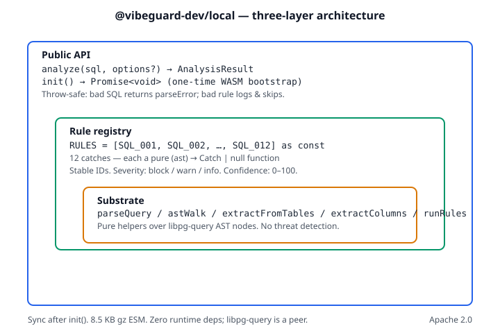

# Architecture

`@vibeguard-dev/local` is a small, opinionated static-analysis library
for SQL emitted by AI agents. This document explains how it's laid out
and why — written for both contributors and curious readers.

## The problem

AI agents that write SQL produce a class of failure modes — cartesian
explosions, unbounded `UPDATE`s, NULL-comparison footguns, recursive
CTEs without termination — that are easy to spot at the SQL-shape
level but hard to catch in any other layer of the stack. The database
sees the query too late. The application's ORM doesn't see hand-
written SQL at all. A wire-protocol proxy can intercept, but adds
operational complexity.

Static analysis on the SQL string is cheap, deterministic, and
deployable as a library. That's what this SDK is.

## The shape of the answer

Three concentric layers, smallest at the core:



```
┌───────────────────────────────────────────────────────┐
│  Public API                                           │
│  analyze(sql) → AnalysisResult                        │
│                                                       │
│   ┌─────────────────────────────────────────────┐     │
│   │  Rule registry                              │     │
│   │  RULES = [SQL_001, …, SQL_012]              │     │
│   │                                             │     │
│   │   ┌─────────────────────────────────────┐   │     │
│   │   │  Substrate                          │   │     │
│   │   │  parseQuery / astWalk / extract*    │   │     │
│   │   └─────────────────────────────────────┘   │     │
│   └─────────────────────────────────────────────┘     │
└───────────────────────────────────────────────────────┘
```

The outer layer depends on the inner. The inner doesn't know about
the outer.

## Layer 1 — Substrate

Pure helpers over the libpg-query AST. Nothing in the substrate
encodes any specific threat detection — these are reusable primitives.

```ts
// src/parser.ts
export function parseQuery(sql: string): { ast: unknown; error?: ParseError };

// src/ast-walk.ts
export function astWalk(root: unknown, visitor: AstVisitor): void;

// src/extract-tables.ts
export function extractFromTables(stmt: unknown): FromTable[];

// src/extract-columns.ts
export function extractColumns(stmt: unknown): ColumnRef[];

// src/run-rules.ts
export function runRules(
  ast: unknown,
  rules: readonly Rule[],
  options?: RunRulesOptions,
): Catch[];
```

`astWalk` is iterative, not recursive — adversarial nesting (a thousand-
level subquery, a malformed AST) can't blow Node's call stack. The
walker enforces a `MAX_DEPTH` of 1000 with a single warning, so a
pathological input degrades gracefully rather than crashing.

The substrate is intentionally small. We resist building an
"AST-querying DSL"; every contributor brings their own opinions about
what such a DSL should look like, and the cost of getting it wrong
forever is high. Better to keep the substrate primitives small and
let each rule make its own narrowing choices.

## Layer 2 — Rule registry

Twelve catches, one per `SQL-NNN` ID, each a pure function from a
parsed AST to either `Catch` (the rule fired) or `null` (it didn't).

```ts
// src/rules/sql-001-cartesian.ts (excerpt)
export const SQL_001: Rule = (ast) => {
  let stmt: Record<string, unknown> | null = null;
  astWalk(ast, (node) => {
    if (node && typeof node === 'object' && 'SelectStmt' in node) {
      stmt = (node as { SelectStmt: Record<string, unknown> }).SelectStmt;
      return 'stop';
    }
    return undefined;
  });
  if (!stmt) return null;

  const tables = extractFromTables({ fromClause: stmt['fromClause'] });
  if (tables.length < 2) return null;
  // ... check for JoinExpr; check for cross-table WHERE predicate ...

  return {
    code: 'SQL-001',
    title: 'Cartesian explosion risk',
    severity: 'block',
    confidence: 95,
    detail: '...',
    fix: '...',
    threatCategories: ['denial-of-service'],
  };
};
```

Each rule lives in its own file under `src/rules/`. The registry is a
single `as const` array in `src/rules/index.ts` — adding a rule is
one new file plus one line in that array.

This keeps rules **composable** (each testable in isolation),
**predictable** (same input → same output, every time), and **easy
to extend** without framework-level surgery.

## Layer 3 — Public API

One entry point. Everything else exists to support it.

```ts
// src/index.ts (the consumer surface)
import { analyze, init, type Catch } from '@vibeguard-dev/local';

await init(); // one-time WASM-parser bootstrap

const result = analyze("UPDATE users SET email = 'x'");
//   { catches: [{ code: 'SQL-003', severity: 'block', confidence: 99, … }] }
```

We export the substrate helpers (`astWalk`, `extractFromTables`,
`extractColumns`, `parseQuery`, `runRules`) for advanced users who
want to build their own checks on the same primitives. We don't try
to be a framework — static SQL safety analysis is the problem;
`analyze()` is the answer.

## Severity, confidence, threat categories

Catches carry three orthogonal signals so consumers can map them to
their own policies:

- **Severity** — `'block'` (dangerous in essentially all contexts),
  `'warn'` (suspicious or context-dependent), `'info'` (worth
  noting but rarely a blocker). Closed-set; adding a tier is a
  major-version event.
- **Confidence** — 0–100, rule-author-set. Communicates detection
  certainty to the caller; the SDK does not gate firing on
  confidence. There is no global confidence "ladder" in the SDK —
  the cloud product has its own ladder for cross-rule prioritization,
  but the SDK leaves the meaning of "75 vs 85" to the rule's docs
  page.
- **Threat categories** — six closed-set tags (`destruction`,
  `exfiltration`, `injection`, `denial-of-service`, `corruption`,
  `integrity`). Catches tag themselves with one or more.

Consumers compose: "block on `block`-severity catches with confidence
≥ 80, warn on the rest" is a simple policy that works against the
SDK's output without further translation.

## Throw-safety as a contract

The rule runner wraps every rule call in a `try/catch`. A rule that
throws — perhaps because it encountered a libpg-query node shape it
didn't anticipate — is logged via the consumer's logger (or
`console.error` by default) and treated as "did not fire" for that
input. Other rules continue.

This is a deliberate fail-safe: a single misbehaving rule must never
take down a consumer's entire pre-flight pipeline. For a security-
adjacent tool, fail-quiet is wrong (you'd miss real threats); fail-
loud-but-isolated is right.

## What we deliberately don't do

- **No async on the hot path.** `analyze()` is synchronous. The one
  async step is `await init()` at startup — unavoidable because
  libpg-query ships its parser as a WASM module and Node's WASM
  compile is async by default. After init, every `analyze()` call is
  fully synchronous.
- **No state between calls.** No module-level caches, no singletons,
  no warm-up. Trivially safe to use in concurrent server contexts.
- **No cache.** Every call re-parses the input. If a consumer wants
  memoization, they wrap us. We don't bake it in.
- **No telemetry.** No phone-home, no usage metrics, no version-
  check pings. This is a security-critical tool; it shouldn't
  introduce new outbound traffic.
- **No bundled WASM.** `libpg-query` is a peer dependency. Consumers
  install it alongside the SDK. We declare the supported version
  range in `peerDependencies`; a missing peer surfaces a clear
  error from `init()`.

## Where the cloud product picks up

This SDK does static analysis. The [VibeGuard](https://vibeguard.dev)
cloud product builds on the same substrate idea but adds the things
you can't do statically:

- **Intent-vs-SQL comparison** — needs an LLM call to compare what
  the agent said it would do against what the SQL would actually
  do. Can't run locally without a model behind it.
- **Real blast-radius estimation** — needs a connection to the
  upstream Postgres planner so EXPLAIN can estimate row counts.
- **Tamper-evident audit logging** — needs a hash-chained backing
  store and the operational layer that rotates / verifies it.
- **Human-in-the-loop escalation** — needs workflow infrastructure
  (queues, reviewer UI, approvals). Out of scope for a library.
- **Per-agent behavioral baselines** — needs persistent state
  across many calls.

That's the intentional split. The SDK ships the static piece.
The cloud ships the stateful pieces. Both are real; neither
replaces the other.

## Further reading

- [STABILITY.md](./STABILITY.md) — what we promise to keep stable
  across versions
- [CONTRIBUTING.md](./CONTRIBUTING.md) — how to propose a new catch
- [examples/](./examples/) — three runnable integration examples
  (Claude Code, Cursor, Replit Agent)
- [docs/rules/](./docs/rules/) — one page per catch
- [benchmarks/](./benchmarks/) — perf-regression harness

## Directory layout (reference)

```
sdk/
├── src/
│   ├── index.ts            # public API
│   ├── types.ts            # Catch, AnalysisResult, Severity, etc.
│   ├── parser.ts           # libpg-query wrapper + init()
│   ├── ast-walk.ts         # generic traversal substrate
│   ├── extract-tables.ts
│   ├── extract-columns.ts
│   ├── run-rules.ts        # registry runner with throw-safety
│   └── rules/
│       ├── index.ts        # RULES registry
│       └── sql-NNN-<slug>.ts  # one file per catch
├── tests/                  # one test file per rule + substrate
├── docs/rules/             # one .md per catch
├── examples/               # integration examples
└── benchmarks/             # fixtures + regression harness
```

## Naming conventions (reference)

- **Catch IDs** — `SQL-NNN` (zero-padded). IDs are forever-stable
  (see STABILITY.md); retired IDs are gone forever, never reused.
- **Rule files** — `src/rules/sql-NNN-<slug>.ts`
- **Rule exports** — `SQL_NNN` (uppercase, underscored)
- **Test files** — `tests/test-sql-NNN-<slug>.test.ts`
- **Doc pages** — `docs/rules/sql-NNN.md`
